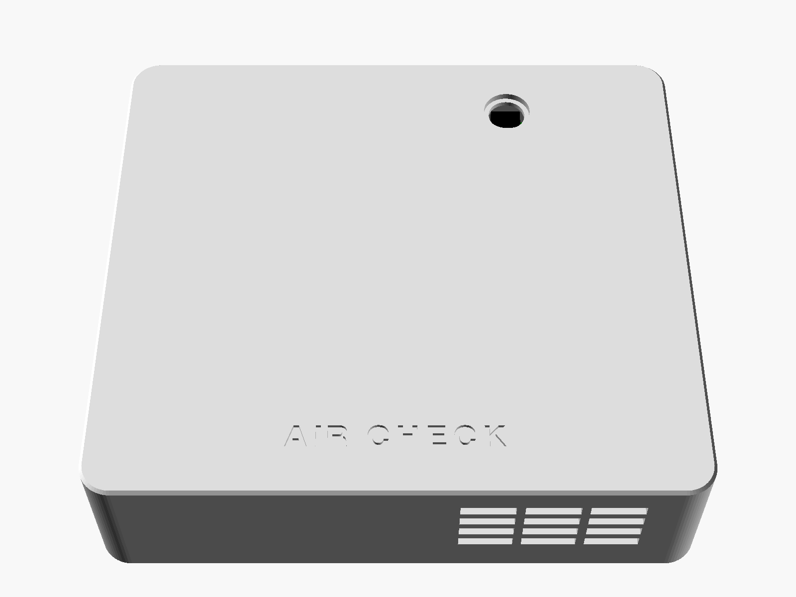

# 3D Printing AIR CHECK

**An open-source Thread/Matter air-quality sensor for 3D-printing emissions.**

A small battery-powered box that sits next to your printer and measures what
the print does to the air. It reports to Apple Home and to your own e-ink
dashboard: locally, with no cloud, no account and no hub beyond the HomePod
mini you already have.

<p align="center">
  
  
</p>

---

## What it measures

| | |
|---|---|
| **Particles** | PM1.0, PM2.5, PM4, PM10 and number concentration: Sensirion SEN62, hourly |
| **CO₂** | NDIR, ±(30 ppm + 3 %): Senseair Sunrise, every 5 min, self-calibrating across power cycles |
| **Climate** | temperature ±0.2 °C and humidity ±1.8 %RH: Sensirion SHT40, every 10 s |
| **VOC** | Sensirion VOC Index, 1–500: SGP40, every 10 s |
| **Itself** | battery level, Thread and Matter status |

Each quantity comes from the sensor that is best at it in a battery device -
v1.3 replaced the SEN63C's CO₂ and T/RH because they are only specified in
continuous operation (EDR-16, EDR-17).

It classifies the air as **GOOD / ELEVATED / HIGH / VERY HIGH** and keeps a
reason for it ("PM2.5 + VOC"). It never says the air is unsafe, because it
cannot know that. See [docs/RISKS.md](docs/RISKS.md).

## How it works

```
 AIR CHECK "3D Printer" ──┐                        ┌──► Apple Home
                          ├── Thread ──► HomePod ──┤
 AIR CHECK "Room" ────────┘               mini     └──► your e-ink dashboard
                                   (border router)       (Matter multi-admin)
```

The sensor has **no display of its own**. It has one button and an RGB LED.
The numbers live in Apple Home and on a separate dashboard that reads the
sensors directly over Matter. That route is standard, local, and needs no
extra hub; [docs/DASHBOARD_INTERFACE.md](docs/DASHBOARD_INTERFACE.md) is the
complete contract for building one.

The power budget is built around one idea. The particle sensor costs about
a hundred times more to run than everything else, so it runs **60 s once an
hour** (the first 30 s are discarded while it settles). CO₂ costs almost
nothing with the Sunrise and is measured every 5 minutes. **VOC, temperature
and humidity are watched every ten seconds**, and when the VOC index climbs
the sensor escalates itself to a particle reading every two minutes.
Printing raises VOC long before an hourly sample would notice.

```
ECO  --VOC rises-->  ACTIVE  --air clears-->  POST-PRINT  -->  ECO
```

## Power and battery life

**USB-C with a built-in LiFePO4 backup** (EDR-21). Plug any USB-C charger
(an 18 W phone charger is plenty) into the socket on top and the device runs
indefinitely; four LiFePO4 18650 cells inside (1S4P) carry it through a power
cut, switched in without a gap. The charger (the cross-project Power-Standard's
module C) pauses charging once the cells are full and tops them up about
once a month. Unattended charging and permanent USB-C operation are allowed.

On the cells alone, with a **25 % engineering margin**:

| mode | particles every | runtime |
|---|---|---|
| **ECO** (default) | 1 h | **2.8 months** (3.5 nominal, 2.4 worst case) |
| NORMAL | 15 min | about 4 weeks |
| ACTIVE | 2 min | about 4 days (automatic, time-limited) |

A particle window every 2 h gives 4.3 months. While the cells charge,
temperature and humidity can read a little high (charger heat); Apple Home and
the dashboard see the charge state and can mark those values. Charging from
flat takes 8-9 h. User guide (German): [docs/NUTZUNG.md](docs/NUTZUNG.md).
Every input is traced in [docs/BATTERY_LIFE.md](docs/BATTERY_LIFE.md), which
is generated from a model you can re-run.

## Hardware

| | |
|---|---|
| MCU | DFRobot FireBeetle 2 ESP32-C6 |
| Sensors | SEN62 (switched off between windows), Sunrise (EN-pin shutdown, ABC state kept by the host), SGP40 + SHT40 (always on) |
| Power | USB-C socket → Adafruit #6091 (TI BQ25185, LiFePO4 3.65 V, 1 A, NTC, 6 h timer) ⇄ 4 × AER18650m2A2 (one fuse each, HY2112 BMS) → Pololu buck-boost 3.90 V → LM66200 → FireBeetle |
| Boards | **no custom PCB**: finished modules, inline resistors and two diodes (EDR-19) |
| Status | one panel button, one RGB LED in a panel holder |
| Case | **136 × 174 × 34 mm**, PETG: battery compartment with a vented charger chamber and a screwed, labelled door; a walled gas bay; electronics |
| Cost | **about EUR 200** in parts including the four cells ([docs/BOM.md](docs/BOM.md)) |

## The LED and the button

| press | |
|---|---|
| short | the LED shows the air quality for 3 s: 🟢 good, 🟡 elevated, 🔴 high, 🟣 very high |
| 3–8 s | pairing mode, the LED blinks blue for 5 minutes |
| 8–12 s | fresh-air CO₂ calibration - **outdoors only**; cyan for 4 min, then green |
| 12–20 s | factory reset, the LED blinks red fast |
| over 20 s | ignored, so a jammed button cannot wipe the device |

While you hold the button the LED shows what letting go would do: blue,
cyan, red. Unprompted, the LED stays dark. The exceptions are a short red blip every
10 s at critical battery or on a hardware fault. "Identify" from the Home app
or the dashboard blinks it white.

## Two devices

There is one hardware design. To watch two places you build two identical
units and name them "3D Printer" and "Room". There is no pairing between them
and nothing in the firmware that knows the other exists. Apple Home and the
dashboard compare them; [docs/SHORTCUTS.md](docs/SHORTCUTS.md) has recipes.

## Build it

```
PARTS -> PRINT + BAKE -> WIRE -> FLASH -> CELLS IN -> PAIR -> SHARE WITH THE DASHBOARD
```

1. **Parts:** [docs/BOM.md](docs/BOM.md)
2. **Print:** four parts, no supports, about 9 h and 200 g of PETG, then
   24 h at 50–60 °C to bake out volatiles:
   [manufacturing/print-settings.md](manufacturing/print-settings.md)
3. **Assemble:** [docs/ASSEMBLY.md](docs/ASSEMBLY.md)
4. **Flash:**
   ```bash
   cd firmware
   . $HOME/esp/esp-idf/export.sh && . $HOME/esp/esp-matter/export.sh
   idf.py set-target esp32c6
   idf.py -p /dev/tty.usbmodem* flash monitor
   ```
5. **Power:** charge the four cells together in an XTAR MX4 (LiFePO4 setting),
   fit them, plug a USB-C charger into the socket on top, and tell the device
   your altitude (`config set altitude_m 520`)
6. **Pair** with Apple Home: [docs/APPLE_HOME.md](docs/APPLE_HOME.md)
7. **Share** with the dashboard: [docs/DASHBOARD_INTERFACE.md](docs/DASHBOARD_INTERFACE.md)

## Status

**Nothing in this repository has been verified on assembled hardware.** No
AIR CHECK has been built. What *has* been done:

| | |
|---|---|
| measurement core | 537 host checks plus the Power-Standard's `pwr_std` tests, run on every build |
| electrical design | 783 automated rule checks over the wiring list, incl. fuse per cell → BMS → charger, P− = GND, the FireBeetle's charger blocked from the cells, SEN62 rail ≥ 3.15 V over the whole battery range, GPIO levels, firmware pin table = wiring |
| enclosure | OpenSCAD asserts: every module against every other, every post, every zone; manifold check; fits a 250 × 210 bed |
| firmware | full ESP-IDF + esp-matter build for esp32c6: 1.69 MB, 14 % OTA headroom |
| Matter attribute IDs | checked against the Matter SDK's generated headers |
| **sensor drivers** | **untested**: every register and timing read from a datasheet |
| **Thread, Matter, Apple Home, dashboard** | **untested**: no controller has seen this device |

[docs/TESTING.md](docs/TESTING.md) is the honest breakdown and the bench
protocol. If you build one, a report is the most useful thing you can
contribute.

## Documentation

| | |
|---|---|
| [ARCHITECTURE.md](docs/ARCHITECTURE.md) | how the whole thing fits together |
| [DASHBOARD_INTERFACE.md](docs/DASHBOARD_INTERFACE.md) | **everything a dashboard needs**: pairing, attribute IDs, timing, power |
| [ENGINEERING_DECISIONS.md](docs/ENGINEERING_DECISIONS.md) | twenty-one decisions and what they cost |
| [NUTZUNG.md](docs/NUTZUNG.md) | power, battery and safety for everyday use (German) |
| [BATTERY_LIFE.md](docs/BATTERY_LIFE.md) | the energy model, with sources |
| [BOM.md](docs/BOM.md) | parts, prices, where to buy |
| [ASSEMBLY.md](docs/ASSEMBLY.md) | step by step |
| [APPLE_HOME.md](docs/APPLE_HOME.md) | what works, what does not |
| [MATTER.md](docs/MATTER.md) | endpoints, clusters, ICD |
| [THREAD.md](docs/THREAD.md) | sleepy end device, border routers |
| [CALIBRATION.md](docs/CALIBRATION.md) | altitude, CO₂ self-calibration, baseline reset |
| [CONFIGURATION.md](docs/CONFIGURATION.md) | every setting and what changing it costs |
| [SHORTCUTS.md](docs/SHORTCUTS.md) | two-device automations |
| [TESTING.md](docs/TESTING.md) | what is verified and what is not |
| [TROUBLESHOOTING.md](docs/TROUBLESHOOTING.md) | when it does not work |
| [RISKS.md](docs/RISKS.md) | **read this before trusting a number** |

## What this is not

Not a medical device. Not a safety detector. Not a certified instrument. The
SEN62 cannot see the ultrafine particles that dominate 3D-printing emissions,
and the VOC Index cannot name a chemical. This device is good at telling you
that the air **changed**, by how much, and how long it took to recover. That is
useful, and it is not the same thing as a health assessment.

## Licence

Apache 2.0. Sensirion's Gas Index Algorithm is vendored under BSD-3-Clause;
see the licence file next to it.
