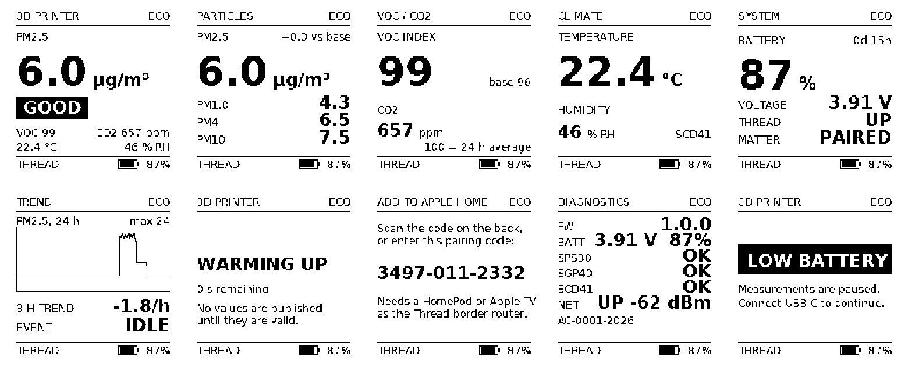

# 3D Printing AIR CHECK

**An open-source Thread/Matter air-quality monitor for 3D-printing emissions.**

A battery-powered box that sits next to your printer and tells you - on its own
screen and in Apple Home - what happened to the air while you were printing.
No cloud, no account, no extra hub beyond the HomePod you already have.

<p align="center">
  
</p>

---

## What it measures

| | |
|---|---|
| **Particles** | PM1.0, PM2.5, PM4, PM10 and number concentration - Sensirion SPS30 |
| **VOC** | Sensirion VOC Index, 1-500 - SGP40 |
| **CO2** | true NDIR photoacoustic - SCD41 |
| **Climate** | temperature and relative humidity |
| **Itself** | battery percentage, charging state, Thread and Matter status |

It reports an air-quality state - **GOOD / ELEVATED / HIGH / VERY HIGH** - and
always says *why*: "HIGH - PM2.5 + VOC". It never says the air is unsafe,
because it cannot know that. See [docs/RISKS.md](docs/RISKS.md).

## Why it exists

3D printers emit particles and volatile organic compounds, and how much
depends on the material, the temperature and the room. Commercial monitors
either cost a fortune, need a cloud account, or last a day on a battery. This
one runs for months, keeps everything local, and is built from parts you can
buy and a case you can print.

## How it works

```
        ROOM AIR
            |
   +--------v---------+          +-------------------+
   |  sensor bay      |          | electronics bay   |
   |  SPS30  (PM)     |  UART    |  ESP32-C6         |
   |  SGP40  (VOC)    +----I2C---+  1.54" e-paper    |
   |  SCD41  (CO2)    |          |  one button       |
   +------------------+          +---------+---------+
        |                                  | Thread (802.15.4)
        v                                  v
     EXHAUST                        HomePod / Apple TV
                                           |
                                      Apple Home
```

The clever part is the power budget. The particle sensor is a hundred times
more expensive to run than everything else put together, so the device does not
watch particles continuously. It watches **VOC every ten seconds** for almost
nothing, and when the VOC index climbs it escalates itself into a mode that
samples particles every two minutes. Printing raises VOC long before a
scheduled particle sample would have noticed.

```
ECO  --VOC rises-->  ACTIVE  --air clears-->  POST-PRINT  -->  ECO
```

## Battery life

On a 4000 mAh cell, with a **25 % engineering margin** applied:

| mode | particles sampled | runtime |
|---|---|---|
| **ECO** | every 4 h | **6.4 months** |
| NORMAL | every 15 min | 3 weeks |
| ACTIVE | every 2 min | 3 days (entered automatically, time limited) |

Every input is traced to a datasheet or a vendor measurement in
[docs/BATTERY_LIFE.md](docs/BATTERY_LIFE.md), which is generated from a model
you can re-run. Nothing has been measured on an assembled device yet - see
*Status* below.

## Hardware

| | |
|---|---|
| MCU | Adafruit ESP32-C6 Feather (ESP32-C6-MINI-1, 4 MB) |
| Display | 1.54 in 200 x 200 e-paper, SSD1681 |
| Battery | 1S LiPo 4000 mAh with protection, user replaceable |
| Case | 122 x 114 x 32 mm, two-part PETG, printed on a 0.4 mm nozzle |
| Cost | EUR 146 without CO2, EUR 171 all-SMD, EUR 190 with breakouts |

Full parts list with manufacturer part numbers: [docs/BOM.md](docs/BOM.md).

## Apple Home

Commission it by scanning the QR code on the back. It joins your Thread
network through a HomePod mini, HomePod 2 or Apple TV 4K, and appears as an
air-quality accessory with temperature, humidity and a battery level.

Automations like *"if PM2.5 at the printer goes above 25, turn on the
ventilation"* are two minutes of work in the Home app.
[docs/APPLE_HOME.md](docs/APPLE_HOME.md) also lists what Apple Home does
**not** show - PM1 has no HomeKit equivalent, and the VOC number is an index
rather than a concentration.

## Two devices

There is one hardware design. If you want to watch two places, you build two
identical units:

```
AIR CHECK  ->  "3D Printer"     AIR CHECK  ->  "Room"
```

No pairing between them, no master and no slave, nothing in the firmware that
knows the other exists. They are two independent Matter accessories. Shortcuts
can compare them - *"printer PM2.5 is 12 above room PM2.5"* - and
[docs/SHORTCUTS.md](docs/SHORTCUTS.md) has working recipes.

## Build it

```
PARTS -> PRINT -> ASSEMBLE -> FLASH -> CHARGE -> PAIR -> USE
```

1. **Parts** - [docs/BOM.md](docs/BOM.md)
2. **Print** - five parts, no supports, about 11 h and 160 g of PETG.
   [manufacturing/print-settings.md](manufacturing/print-settings.md)
3. **Assemble** - an evening. [docs/ASSEMBLY.md](docs/ASSEMBLY.md)
4. **Flash**
   ```bash
   cd firmware
   . $HOME/esp/esp-idf/export.sh && . $HOME/esp/esp-matter/export.sh
   idf.py set-target esp32c6
   idf.py -p /dev/tty.usbmodem* flash monitor
   ```
5. **Charge** - about 24 h from flat, at the Feather's 196 mA charge rate
6. **Pair** - [docs/APPLE_HOME.md](docs/APPLE_HOME.md)

## Using it

One button:

| press | |
|---|---|
| short | wake the screen, then step through the six screens |
| 3-8 s | open the commissioning window |
| 12-20 s | factory reset |
| over 20 s | ignored, so a jammed button cannot wipe the device |

The screen is e-paper, so it holds its last image at zero current. "Display
off" here means "stopped refreshing" - you can walk past it weeks later and
still read the last measurement.

## Status

**Nothing in this repository has been verified on assembled hardware.** No
AIR CHECK has been built. What *has* been done:

| | |
|---|---|
| measurement core | 453 host checks, run on every build |
| electrical design | 371 automated rule checks over the netlist |
| enclosure | OpenSCAD asserts, manifold check, 1.6 % overhang, fits a 250 x 210 bed |
| display | all ten screens rendered and reviewed - see the image at the top |
| firmware | full ESP-IDF + esp-matter build for esp32c6 |
| **sensor drivers** | **untested**; every register and timing read from a datasheet |
| **Thread, Matter, Apple Home** | **untested**; no controller has seen this device |

[docs/TESTING.md](docs/TESTING.md) is the honest breakdown and the physical
validation protocol. If you build one, a report is the most useful thing you
can contribute.

## Documentation

| | |
|---|---|
| [ARCHITECTURE.md](docs/ARCHITECTURE.md) | how the whole thing fits together |
| [ENGINEERING_DECISIONS.md](docs/ENGINEERING_DECISIONS.md) | ten decisions, what they cost |
| [BATTERY_LIFE.md](docs/BATTERY_LIFE.md) | the energy model, with sources |
| [BOM.md](docs/BOM.md) | three build variants |
| [ASSEMBLY.md](docs/ASSEMBLY.md) | step by step |
| [APPLE_HOME.md](docs/APPLE_HOME.md) | what works, what does not |
| [MATTER.md](docs/MATTER.md) | endpoints, clusters, ICD |
| [THREAD.md](docs/THREAD.md) | sleepy end device, border routers |
| [CALIBRATION.md](docs/CALIBRATION.md) | baseline reset vs sensor calibration |
| [CONFIGURATION.md](docs/CONFIGURATION.md) | every setting, and what changing it costs |
| [SHORTCUTS.md](docs/SHORTCUTS.md) | two-device automations |
| [TESTING.md](docs/TESTING.md) | what is verified and what is not |
| [TROUBLESHOOTING.md](docs/TROUBLESHOOTING.md) | when it does not work |
| [RISKS.md](docs/RISKS.md) | **read this before trusting a number** |

## What this is not

Not a medical device. Not a safety detector. Not a certified instrument. The
SPS30 cannot see the ultrafine particles that dominate 3D-printing emissions,
and the VOC Index cannot name a chemical. This device is good at telling you
that the air **changed**, by how much, and how long it took to recover. That is
genuinely useful and it is not the same thing as a health assessment.

## Licence

Apache 2.0. Sensirion's Gas Index Algorithm is vendored under BSD-3-Clause and
the bitmap fonts are generated from DejaVu Sans; see the licence files next to
each.
