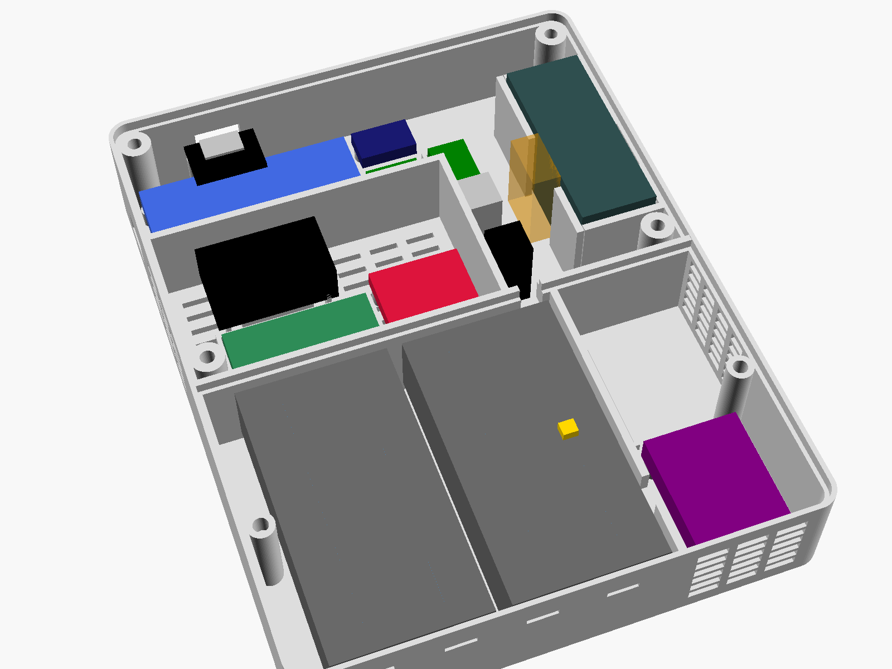

# Assembly

v1.4 has no circuit board to make or order. Everything is a finished module;
you solder wires to module pins, and fourteen through-hole resistors, two
capacitors, two Schottky diodes, four fuses and the NTC in line, under heat
shrink. An evening's work once the parts and prints are on the desk, plus the
cells' first charge in an external charger.

```
PARTS -> PRINT + BAKE -> SET UP THE POWER MODULE -> WIRE -> FLASH -> INTO THE CASE -> CELLS -> PAIR -> SHARE
```



The wiring list, the pin map and where each inline part goes are in
[`electronics/schematic/NETLIST.md`](../electronics/schematic/NETLIST.md).
That file is generated from `design.py` and checked by 748 rules; if this
guide and the netlist ever disagree, the netlist wins.

The power system is the Power-Standard's **module C** (EDR-21): LiFePO4
cells, charged in the device over USB-C. The user guide for everyday use,
charging, damaged cells, storage and disposal is
[`NUTZUNG.md`](NUTZUNG.md) (German).

## 1. Parts

Order everything in [`docs/BOM.md`](BOM.md). One Mouser parcel covers the
SEN62, the Sunrise, the two battery holders and the NTC; the cells come from
akkuteile.de, the BMS from eremit.de, the rest from
Berrybase/Eckstein/Reichelt/Adafruit. Check off:

- [ ] FireBeetle 2 ESP32-C6 (DFR1075)
- [ ] Sensirion SEN62-SIN-T and a 6-way JST GH cable
- [ ] Senseair Sunrise 006-0-0008
- [ ] SparkFun Qwiic SGP40 (SEN-18345) and a Qwiic cable with open leads
- [ ] Seeed Grove SHT40 (101021032) and a Grove-to-jumper cable
- [ ] Pololu #2810 Mini MOSFET Switch LV
- [ ] Adafruit #6091 bq25185 charger (U6)
- [ ] eremit "LiFePO4 1S BMS 2,5A" (HY2112 + 8205A, U5) - **not** a DW01/FS312F/HY2113 board
- [ ] 2 × Keystone 1049 (2 × 18650 holder, THT)
- [ ] 4 × Littelfuse PICO II 2 A fast (0251002.MAT1L), one per cell
- [ ] Semitec 103AT-2 NTC (10 k, B = 3435 K) and Kapton tape
- [ ] Pololu #5719 S9V11E2A regulator (PS1)
- [ ] Adafruit #5830 LM66200 ideal diode
- [ ] Adafruit #6050 sunken USB-C breakout (J2, the charging and power socket)
- [ ] JST PH 2-way pigtail
- [ ] RGB LED 5 mm common anode, SMR1089 panel holder, T 250A push button
- [ ] resistors 2 × 470 k, 2 × 150 k, 2 × 100 k, 33 k, 2 × 10 k, 2 × 4.7 k, 1 k,
      2 × 330 Ω; 2 × 100 nF; 2 × BAT43
- [ ] 6 × M2.5 heat-set inserts; M2.5 × 8 screws (6); M2.5 self-tappers (8:
      four for the SGP40, four for the #6091); M2 self-tappers (8: four for the
      FireBeetle, two for the LM66200, two for J2); M3 self-tappers (4, two per
      battery holder); silicone wire 22 AWG red/black and 26 AWG; heat shrink
- [ ] 4 × Lithium Werks **AER18650m2A2** LiFePO4, one type, one batch
- [ ] for the cells' first charge: an XTAR MX4 (LiFePO4 setting) - not in the BOM
- [ ] a USB-C charger, 5 V / 1.5 A or more (an 18 W phone charger is plenty),
      and a USB-C-to-C cable

## 2. Print and bake

[`manufacturing/print-settings.md`](../manufacturing/print-settings.md) has
the profile: four parts, no supports, **PETG only** - no PLA anywhere near
the cells or the charger. Then **bake all printed parts for 24 h at
50–60 °C** (oven with a thermometer, door ajar, or a filament dryer). Fresh
PETG gives off volatiles for weeks; the SGP40 would learn that as its
baseline. Let the parts air for a day afterwards.

Check the prints:

- [ ] the lid and the door each drop into the front shell with an even gap
- [ ] the SEN62 slides into its cradle, port face against the left wall (left
      seen from the front)
- [ ] every slot in that wall is open, with a clean bridge roof
- [ ] the gas bay's side-wall and front slots are open (right side, seen from the front)
- [ ] the SHT40 board drops into its fence snugly, the Sunrise between its four guides
- [ ] the charger chamber's vents are open: in the bottom wall and high in
      its side wall
- [ ] the door has its four cell-retaining ribs and the NTC finger, and the
      engraved label is legible

## 3. Heat-set inserts

Six M2.5 inserts: four into the lid posts, two into the door posts in the
side walls of the battery compartment. Iron at 220 °C, straight down until
flush, let them cool.

## 4. Set up the power module - before any cell is connected

Everything here happens on the bench, with no cell anywhere near the
#6091. The Power-Standard's inspection protocol, adapted to AIR CHECK, is in
[`TESTING.md`](TESTING.md) (PS-1.1 .. PS-4.7); fill it in as you go.

**4.1 The #6091's jumpers** (board file rev B1):

| jumper | side | do | why |
|---|---|---|---|
| VS | top | **cut** | the factory setting is 4.2 V - Li-ion, wrong for LFP |
| 3.65V | bottom | **bridge** | charge voltage 3.65 V, set by resistor |
| 1 Amp | bottom | **bridge** | the factory default is 500 mA, whatever the product page says (Adafruit issue #2) |
| TH | top | **cut** | for the NTC; with TH closed there is no temperature protection at all |

The VS and IS header pads stay open. Write **"LFP 3,65 V"** on the board.

**4.2 Measure without a cell.** J2 VBUS to #6091 DCIN+, J2 GND to DCIN−, a
USB-C charger into J2:

1. BATT+ to BATT−: **3.60–3.70 V** (it may wander briefly).
   **4.1–4.25 V: stop** - a jumper is wrong. Never fit cells to a board that
   has not passed this.
2. LOAD+ to LOAD−, nothing connected: **4.41–4.59 V**.

**4.3 PS1, the regulator: 3.90 V.** PS1 VIN to #6091 LOAD+, PS1 GND to
LOAD−, still with the charger in J2 and no cell. Turn the trimpot until VOUT
reads **3.90 V ± 0.03 V** on a multimeter; clockwise raises it. PS1's EN
stays open. Unplug the charger.

**4.4 The cells.** Charge all four together in an XTAR MX4, switch on
**LiFePO4**, until all show full. Measure each: **at most 20 mV** between the
highest and the lowest. One type, one batch - never mix.

**4.5 The BMS.** Read the IC's marking: **HY2112**. A DW01 board cuts off
only at ≥ 4.25 V and does not protect LFP.

## 5. Wiring

Solder and heat-shrink as you go. **22 AWG** for everything that carries the
cells' or the charger's current (cells, fuses, BMS, #6091 BATT/LOAD/DCIN,
PS1, LM66200, the pigtail), **26 AWG** for signals and sensors. Wire
colours: red = supply, black = GND, blue = SDA, yellow = SCL, anything else
for control lines.

### 5.1 Power path

**Cells to the charger** (in the battery compartment):

| from | to | note |
|---|---|---|
| each cell's + contact pin (two per holder) | its own **PICO II 2 A** | at the pin, under heat shrink |
| the four fuses' other ends | BMS **B+** | the cells meet only here |
| the four − contact pins | BMS **B−** | B− goes nowhere else |
| BMS **P+** | #6091 **BATT+** | VCELL |
| BMS **P−** | #6091 **BATT−** | **P− is the ground of the whole device** |
| NTC 103AT-2 | #6091 **TH** and the **DCIN− pad** | there is no GND pad beside TH; the bead goes onto a cell in step 7 |

**Charger to the FireBeetle:**

| from | to | note |
|---|---|---|
| J2 VBUS | #6091 **DCIN+** | 5 V from the charger. J2's data, CC and SBU pins stay open |
| J2 GND | #6091 **DCIN−** | |
| #6091 **LOAD+** | PS1 **VIN** | 3.0–3.65 V on the cells, 4.5 V on USB-C |
| #6091 LOAD−, PS1 GND | GND | |
| PS1 VOUT | LM66200 **VIN1** | +VREG, 3.90 V (step 4.3) |
| LM66200 **VIN2**, **ON**, GND | GND | ON low = always enabled |
| LM66200 VOUT | JST PH pigtail **+** | VSYS |
| pigtail **−** | GND | |
| pigtail **+** | Sunrise pin 2 (VBB) and the LED's common anode | spliced onto the + lead |

**Measurement and control** (at the FireBeetle, NETLIST.md "Inline parts"):

| part | from | to |
|---|---|---|
| **R1 470 k** | BMS P+ lead | FireBeetle **IO3** (VBAT_S, cell / 2) |
| **R2 470 k**, **C1 100 nF** | IO3 | GND |
| **R20 100 k** | the J2 / DCIN+ wire | PWR-K node at **IO4** |
| **R21 150 k**, **C2 100 nF** | IO4 | GND |
| **D20 BAT43** + **R22 150 k** | cathode on the #6091's **S2** pad, anode to R22 | R22 to IO4 (CHG_N) |
| **D21 BAT43** + **R23 33 k** | cathode on the #6091's **S1** pad, anode to R23 | R23 to IO4 (FLT_N) |
| wire | FireBeetle **IO5** | #6091 **!CE** (charge pause) |

**Check the pigtail polarity against the "+" on the FireBeetle** before you
plug it in. JST PH leads are not standardised. Then plug it into the
FireBeetle's battery socket.

The FireBeetle's own Li-ion charger (CN3165) never reaches the cells: with a
computer on its USB-C it holds VSYS at 4.2 V, and the LM66200 blocks that
from +VREG. Only J2 charges the cells, through the #6091.

### 5.2 SEN62 and its switch

| from | to |
|---|---|
| FireBeetle 3V3 | Pololu #2810 VIN |
| FireBeetle IO2 | #2810 ON |
| #2810 VOUT | SEN62 pins 1 and 6 (VDD) |
| GND | #2810 GND, SEN62 pins 2 and 5 |
| FireBeetle SDA (GPIO19) | SEN62 pin 3; **R3 4.7 k** to #2810 VOUT |
| FireBeetle SCL (GPIO20) | SEN62 pin 4; **R4 4.7 k** to #2810 VOUT |

**Leave the #2810's slide switch in OFF.** Only then does its ON pin have
control. The pull-ups go to the *switched* supply, so nothing feeds the SEN62
while it is off.

### 5.3 Sunrise

Handle it by its PCB tabs, never by the housing or the filter. Solder at
380 °C for at most 2 s per pin, from below (ANO4947).

| Sunrise pin | to |
|---|---|
| 1 GND | GND |
| 2 VBB | pigtail + (5.1) |
| 3 VDDIO | FireBeetle **IO18** |
| 4 SDA | FireBeetle **IO17**; **R5 10 k** across pins 3–4 |
| 5 SCL | FireBeetle **IO21**; **R6 10 k** across pins 3–5 |
| 6 COMSEL | GND (selects I2C) |
| 7 nRDY | nothing |
| 8 DVCC | nothing |
| 9 EN | FireBeetle **IO14**; **R7 100 k** from IO14 to GND at the FireBeetle |

VDDIO and the pull-ups come from GPIO18, which the firmware drives high only
while the sensor is enabled - Senseair forbid any signal on the bus while EN
is low.

### 5.4 SGP40 and SHT40 (always on)

| | SGP40 (Qwiic cable) | SHT40 (Grove cable) | FireBeetle |
|---|---|---|---|
| supply | red 3V3 | red VCC | 3V3 |
| ground | black | black | GND |
| SDA | blue | white | **IO6** |
| SCL | yellow | yellow | **IO7** |

On the SparkFun board **cut the PWR jumper** (its LED would draw more than
the sensor). Leave the I2C jumper closed: its 4.7 k pull-ups are the bus's.
GPIO6/7 are the only pins of the ESP32-C6's low-power I2C.

### 5.5 LED and button

| from | to |
|---|---|
| LED red cathode | **R8 1 k** → IO16 |
| LED green cathode | **R9 330 Ω** → IO22 |
| LED blue cathode | **R10 330 Ω** → IO23 |
| LED common anode (longest lead) | pigtail + (5.1) |
| button | IO1 and GND |

## 6. Flash and smoke test, on the bench

Cells in the holders (polarity as marked in the holders; measure each
contact first), J2 empty, the boards on the desk. Plug a computer into the
FireBeetle's USB-C and flash:

```bash
cd firmware
. $HOME/esp/esp-idf/export.sh
. $HOME/esp/esp-matter/export.sh
idf.py set-target esp32c6
idf.py -p /dev/tty.usbmodem* flash monitor
```

Within a few seconds:

```
I (xxx) aircheck: 3D Printing AIR CHECK 1.4.0
I (xxx) aircheck: serial AC-XXXX-XXXX
I (xxx) sgp40: VOC index algorithm at a 10 s sampling interval
I (xxx) aircheck: SEN62 <serial>
I (xxx) sunrise: configuration OK: single mode, 32 samples, ABC on (180 h, 425 ppm)
I (xxx) aircheck: power: LFP 1S4P module; site 0 m = 1013 hPa
I (xxx) ac_matter: endpoints: air=... temperature=... humidity=... usb-c=...
I (xxx) aircheck: not commissioned; manual code ..., QR MT:...
```

then a CO2 reading (`sunrise: CO2 ... ppm`), a power line such as
`power: cells, cells 3.xx V (NN %), not charging, VSYS 4.2x V` (the computer
on the FireBeetle's USB counts as external power for the measurement engine,
and its charger holds VSYS at 4.2 V) and the SEN62's fan running (continuous
mode). If an error line appears instead, stop here:
[`TROUBLESHOOTING.md`](TROUBLESHOOTING.md). It is far easier to debug on the
bench.

Tell the device where it stands:

```bash
python3 tools/configuration/aircheck_config.py --port /dev/tty.usbmodem* set altitude_m 520
```

Press the button once: the air-quality colour for 3 s. Hold it 3 s: blue,
pairing mode. Check red, green and blue each light.

Then the power sources (TESTING T-L1..T-L6): a charger in J2 as well - the
log switches to `power: USB-C, cells ...` (charging, full or charge paused,
depending on the cells); unplug the computer, then the charger -
`power: cells`, without a reset.

## 7. Into the case

1. **Battery compartment** (bottom). The two holders onto their bosses, two
   M3 self-tappers each; the contact pins and the fuses soldered to them hang
   free on the 5 mm standoffs. The **#6091** into the charger chamber
   (bottom left seen from the front, bottom right seen from the back) on its
   four posts with M2.5 self-tappers, the **BMS** strip into its fence above
   it. The cell leads pass through the notch in the chamber wall. **NTC:**
   the bead with a layer of Kapton onto holder 2's outer cell (the one next
   to the charger chamber, the warmest) - the door's finger will hold it
   there, not the wire.
2. **SEN62.** Stick an EPDM frame around each of the two windows on its port
   face (one round both inlets, one round the outlet). This is the one
   gasket in the device, and it is outside the gas bay. Slide the SEN62 into
   its cradle, port face against the left wall, square inlet towards the
   front, and plug in its cable.
3. **Gas bay** (right side seen from the front, walled off): SHT40 into its
   fence, low and next to the vents; SGP40 onto its four posts with M2.5
   self-tappers; Sunrise onto its pedestal, filter towards the lid, pins
   hanging free at both ends. **No tape, glue, foam or hot glue in here.**
   Lead the three cables out over the bay's top wall, where the lid's rib
   closes over them.
4. **FireBeetle** onto its four posts, M2 self-tappers, USB-C in the opening
   in the right-hand wall.
5. **Power modules** into their pockets beside the FireBeetle: #2810 and
   PS1 (trimpot facing the lid), the LM66200 on two M2 self-tappers.
6. **J2**, the USB-C socket, onto its two posts at the top wall with two
   M2 self-tappers, socket in the opening in the top wall, towards the
   right-hand side seen from the front (above the FireBeetle's own USB-C).
   The screws take the plugging force, not the solder joints.
7. **LED holder and button** through the front, nuts from the inside.
8. The wires between the charger chamber and the electronics zone (DCIN,
   LOAD, S1/S2, !CE, BMS P+ for VBAT_S) run through the partition notch.

Keep every wire out of the SEN62's plug keep-out, off the cells' mantles and
away from the lid's and the door's screw posts.

## 8. Close it

Lid: four M2.5 × 8 screws into the inserts, cross pattern, snug - the
inserts spin out of plastic long before a screw strips. Put the four cells
in (match the + marks in the holders), check the NTC bead sits on its cell,
then the door with its two screws (hex key 2 mm). The ribs on the door stand
1 mm above the cells and keep them in the holders in a fall.

## 9. Pair and share

[`APPLE_HOME.md`](APPLE_HOME.md): scan the QR code, name it, put it in a
room. Print the label with `tools/commissioning/make_label.py` and stick it
on the lid, clear of the engraved battery label on the door. For the
dashboard: Home app → the sensor → Accessory Settings →
**Turn On Pairing Mode** → give the code to the dashboard
([`DASHBOARD_INTERFACE.md`](DASHBOARD_INTERFACE.md)).

## 10. Configure

| setting | when |
|---|---|
| `altitude_m` | always: the CO2 pressure correction (1.6 % per 10 hPa) |
| `default_mode` | NORMAL next to a busy printer: about 4 weeks on the cells instead of 2.9 months. On USB-C it does not matter: the device runs CONTINUOUS |
| `name` | published as Matter NodeLabel so the dashboard can tell units apart |

## Running from a USB-C charger

Plug a USB-C charger (5 V / 1.5 A or more) into J2, the socket in the top
wall, with a C-to-C cable. J2 asks for plain 5 V, no negotiation. The #6091
then feeds the device from the charger and charges the cells with what is
left (power path); the device runs CONTINUOUS. Pull the charger and it
carries on from the cells without a gap.

**Permanent and unattended operation on USB-C is allowed** - that is what
module C is built for (Power-Standard rule 6a). After a full charge the
firmware pauses charging and releases it when USB-C was unplugged, the cells
drop below 3.30 V, or after 30 days: on permanent USB-C the cells are topped
up about once a month. Charging from flat takes 8–9 h.

While the cells charge, temperature and humidity can read a little high: the
charger dissipates 0.85–1.7 W in its chamber. Matter's `BatChargeState` says
IsCharging for exactly that window; nothing is compensated. Charge only at
0–45 °C room temperature; the NTC stops charging outside 0–60 °C at the
cell.

The FireBeetle's own USB-C is for configuration and updates only. It does not
charge the cells.

## Placement

Beside the printer, not inside its enclosure and not in its fan draught
(the SEN62 must not sit in airflow above 1 m/s). Keep the left side (particle
ports), the right side (gas bay vents) and the bottom (charger vents) free,
out of direct sun and away from radiators. The CO2 self-calibration needs
fresh air about once a week - a room that is aired now and then is enough
(`CALIBRATION.md`).

Two keyholes in the lid, 70 mm apart horizontally, for two pan-head screws
standing about 3 mm proud of the wall.

## Changing cells

Cells are changed only for repair - the device charges them itself. The
yellow low-battery blink means **plug in USB-C**, not new cells.

1. Unplug USB-C, open the door (two screws, hex key 2 mm).
2. Take out **all four** cells. Never replace single cells.
3. New cells of the same type (AER18650m2A2) and batch, charged together in
   the XTAR MX4 (LiFePO4) first, **at most 20 mV** apart.
4. Polarity as marked in the holders, the NTC bead back under the door's
   finger, door on.

A hot, swollen, dented or leaking cell, or a damaged compartment: stop
charging and follow [`NUTZUNG.md`](NUTZUNG.md) §4.
